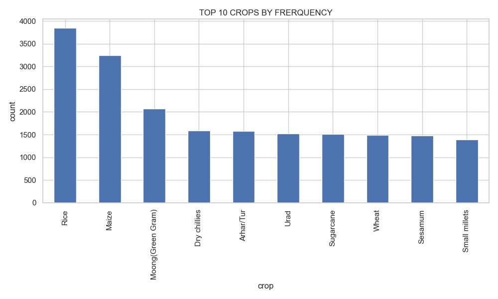
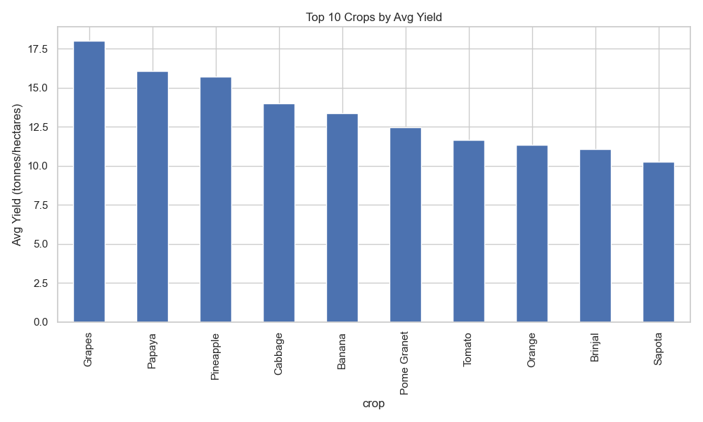
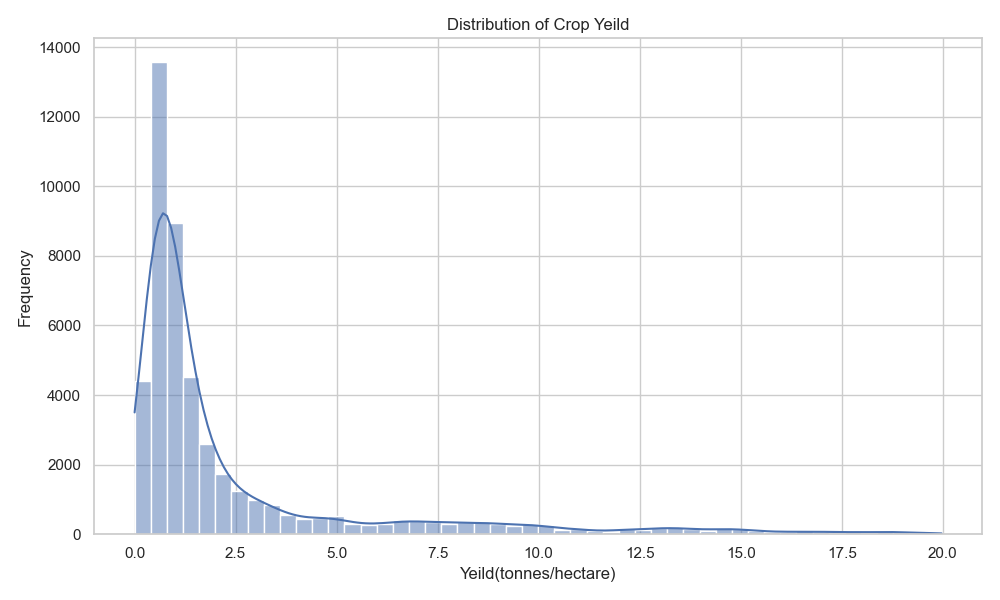
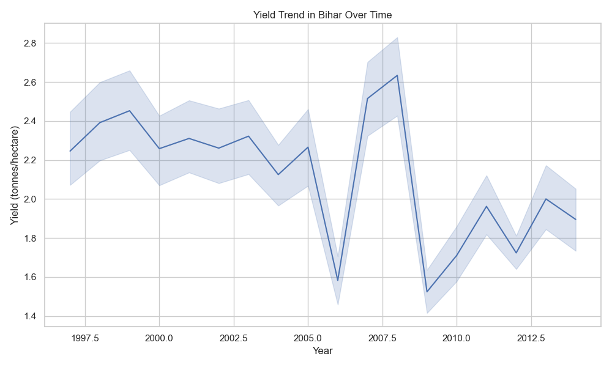
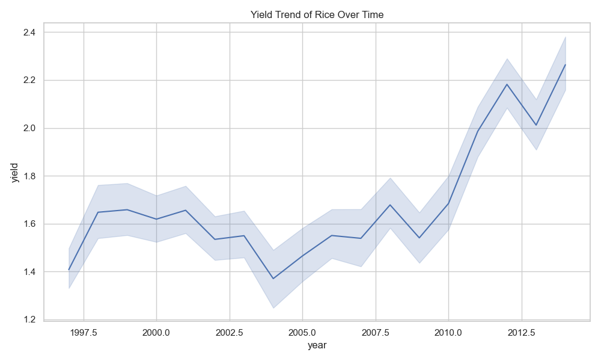
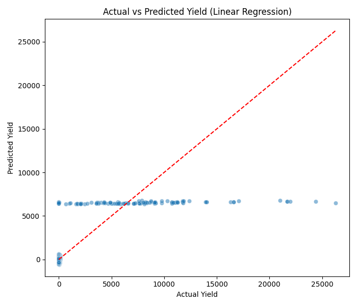
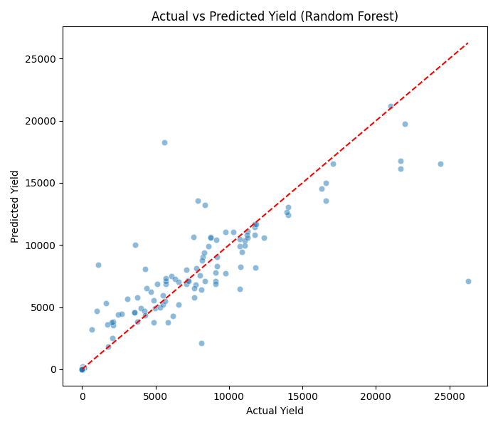

# 🌾 Crop Yield Predictor (India)

Predicting agricultural crop yield (in tonnes/hectare) using machine learning based on crop type, area, state, district, and year. This project uses real data from the **Government of India**.

---

## 📌 Objective

To analyze and predict crop yield across Indian states and districts using machine learning models. This project can help:
- Understand trends in agricultural productivity
- Identify high-performing crops
- Assist in policy-making and resource allocation

---

## 📂 Dataset

- **Source**: [data.gov.in](https://data.gov.in/)
- **Records**: ~50,000 rows
- **Columns include**:
  - `state`, `district`, `year`
  - `crop`, `area`, `production`
  - Derived: `yield = production / area`

---

## 🔍 Exploratory Data Analysis

### ✅ Top Crops by Frequency

### ✅ Average Yield by Crop (Top 10)

### ✅ Distribution of Crop Yield

### ✅ Yield Trends in Bihar Over Time 

### ✅ Yield Trends of Rice Over Time 

---

## ⚙️ Machine Learning Models

### 🔹 Linear Regression
- **MSE**: ~386,288
- **R²**: ~0.607
- 

### 🔹 Random Forest Regressor
- **MSE**: ~107,404
- **R²**: ~0.891 ✅
- 

✅ **Random Forest** performed significantly better in capturing non-linear relationships in the data.

---

## 🛠️ Tech Stack

- Python
- Pandas, NumPy
- Seaborn, Matplotlib
- scikit-learn (Linear Regression, Random Forest)
- Requests (for API)
- dotenv

---

## 📈 Future Work

- Incorporate weather, rainfall, and soil data for improved prediction
- Add feature importance and hyperparameter tuning
- Build a simple Streamlit web app for interactive prediction

---

## 📁 Folder Structure

Crop-Yield-Predictor/
│
├── fetch_data.py # Fetch data from data.gov.in API
├── clean_data.py # Data cleaning steps
├── eda.py # Exploratory Data Analysis & Plots
├── model.py # ML models and evaluation
├── plots/ # All output images and charts
├── data/ # Raw and cleaned CSV files
├── requirements.txt
└── README.md

---

## 👤 Author

**Gourav Verma**  

---

## 🏷️ Tags

`#crop-yield-predictor` `#ml-project` `#agriculture` `#data-science`